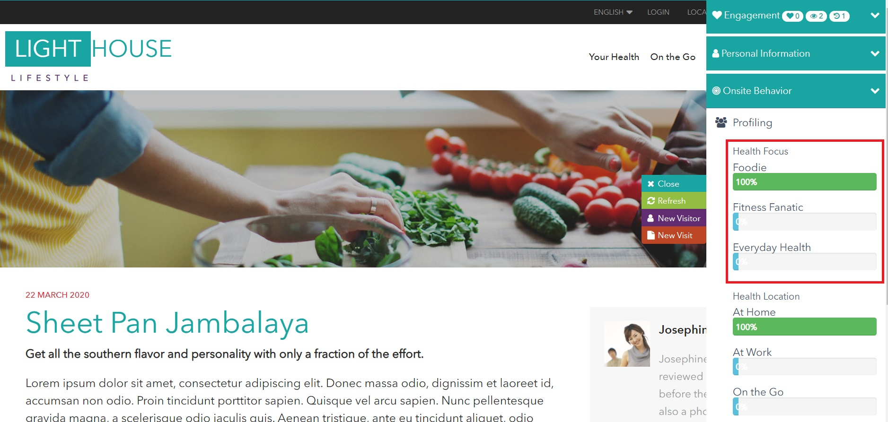

So you've just got your hands on a Sitecore instance running the Lighthouse demo - what next? This post will help you explore some of the marketing features available in the demo (Yes, those mythical phase 2 marketing features!).

## The Demo Sidebar

The concept of a demo sidebar has existed in many different versions of Sitecore demos over the years. Let's face it, it can be overwhelming to try and keep track of everything Sitecore is doing at any given time. The idea is for the demo sidebar to help visually explain what Sitecore is doing behind the scenes in real time.

You can expand the demo sidebar at any time by clicking on the info icon anchored to the right-hand side of site.

  

For a new visit, you will start with an anonymous Sitecore contact with very no previous analytics data. It won't take long to watch the analytics grow!

  

The demo sidebar enables you to walk through a visit in real time while stopping to explain each step of the journey. This can be invaluable when showing how Sitecore tracks analytics and uses this information in real time to create a personalized experience for each visitor.

## Passive Personalization

Profiling is an critical part of Sitecore's marketing features. It allows Sitecore to segment your visitors and present personalized content in real time. All this happens while a visitor clicks on a few web pages!

As an example, all articles on the demo site have been profiled based on predefined visitor profiles configured in the Marketing Control Panel. 

  

There are many different visitor profiles set up but here is one as an example:

**Health Focus**
- Everyday Health
- Fitness Fanatic
- Foodie

As a visitor browses the demo website, they will be segmented into one of the 3 options listed above for the "Health Focus" profile.

In this example visit, a new visitor has viewed a single article (profiled as a foodie article) and they have been automatically placed in the "Foodie" segment.

  

Based on this real time segmentation, we can start to personalize the visitor experience. Navigate back to the home page to find the carousel has been personalized to show "Foodie" realted content.

  

## Active Personalization

The demo site introduces the concept of active personalization where site visitors are segmented based on information they voluntarily provide. This type of first party information is extremely valauble due to it's accuracy compared to other types of data collection.

  

The home page contains a call-to-action to go to a multi-step form. This form is configured using Sitecore Forms functionality to create a 3-step questionnaire. There is a custom form submit action configured for each step of the questionnaire that will map a visitor's selection with the pre-configured profiling configured in the Marketing Control Panel.

  

In this example visit, the visitor has selected "Mental Health" on the first step of the questionnaire. Before moving on with the rest of the questionnaire, pause and open the demo sidebar. You will find the visitor has been segmented based on their selection in the first step of the questionnaire.

  

If the visitor drops off and doesn't complete all three questionnaire steps, then no problem since we're gathering more info at each step. Just like in the "Passive Profiling" section above, the visitors are segmented in real time so that personalization can be used to enhance the visitor experience.

## Identifying Contacts

xConnect is at the heart of Sitecore's data analytics strategy and it is important to understand how visitor data is managed across different visitor sessions. The demo was build to help showcase how Sitecore can tie visitor data together in an omni-channel world where visitors are intereating on different devices, different channels such as email and offline, and across multiple web properties.

In the demo, the goal is to create a known contact. We can use the contact's email address as a unique identifier to surface their previous visitor data whenever they return and can be identified.

**There are 3 ways to identify a visitor in Sitecore:**
1. The visitor self-identifies in some way such as:
   - Submits their email address in a simple form
   - Register/Login
2. Clicks a link in an email sent by Email Experience Manager (EXM)
3. Across different Sitecore websites/apps that use the same TLD (top level domain)

The demo is able to support the three identification methods listed above and helps to show how Sitecore supports omni-channel customer journeys.

### Initial Visit

As a simple example, let's start a new visit (In incognito mode or by clicking on the "New Visitor" button in the demo sidebar) and navigate to a page with a Sitecore form. The home page has a call-to-action to go to "Activate Your Fitness Tracker" page.

  

Fill out and submit the form (you do not need to provide a real email address).

  

The visitor has been converted from an *anonymous contact* to a *known contact*! The visitor's email address is listed in the demo sidebar along with "Identification" that signifies that the email address is now being used as a unique identifier for this contact in xConnect.

**!Note**: The demo contains a custom form submit action that is responsible for identifying the contact in xConnect.

  

During this short visit, the visitor has accumulated other analytics data such as engagement value, triggered goals, and has been placed in a marketing automation plan.

  

### Return Visit (ex: Different Device or Broswer)

Once again, let's start a new visit (In incognito mode or by clicking on the "New Visitor" button in the demo sidebar) and navigate to an article with a simple form. The home page has a call-to-action to go to a "Design Your Connected Home" article.

  

Scroll down on the article page and submit the newsletter form (**!important** - Make sure you use the same email address as the previous visit to tie the visits together).

  

Open the demo sidebar in order to see the results. In this visit we have only given an email address but we are able to pull all other avaialble xConnect data for the contact with this email address. For example, the first name and last name for this contact was loaded from the previous visit as well as the "Fitness Tracker Registered" goal that was triggered in the previous visit.

As another example, The total engagment value for this contact is now calculated based on the current and previous visits combined.

In the scenario described above, the initial and return visits both occured in the same browser (different browser sessions) but it is easy to understand how this scenario could take place across different devices or channels such as return visits on a mobile device.

## In Closing

That's all for now! Hopfully this post will give you a solid base to explore the demo. There are so many more marketing features to explore such as **Goals, Campaigns, Marketing Automation Plans, Dynamic Contact Lists, and more**. Once you feel comfortable with the basic marketing features available in the demo, you can move on to more complex and in depth demo scenarios.